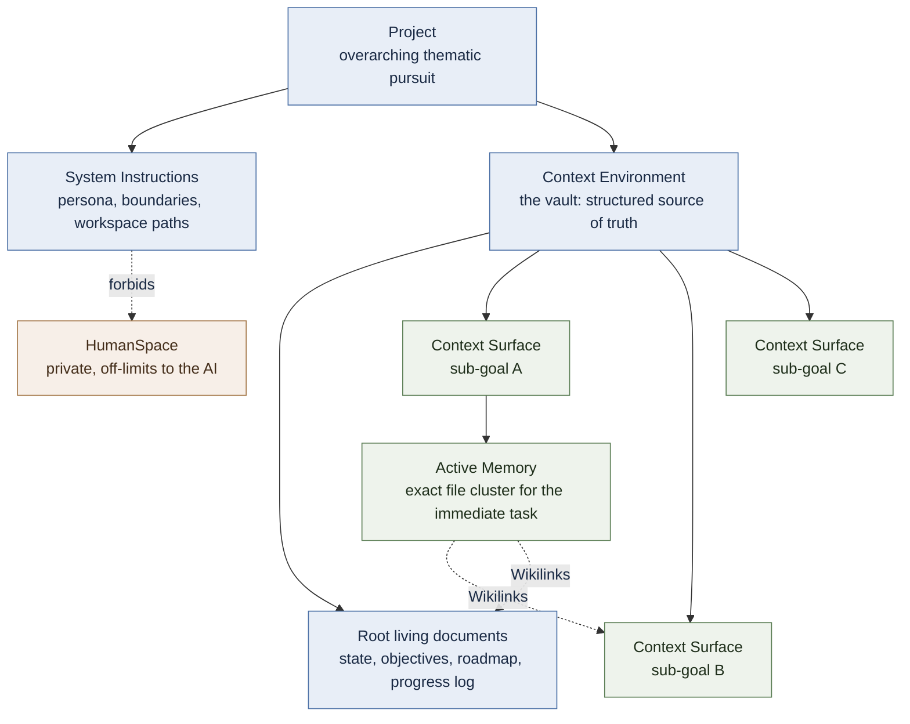
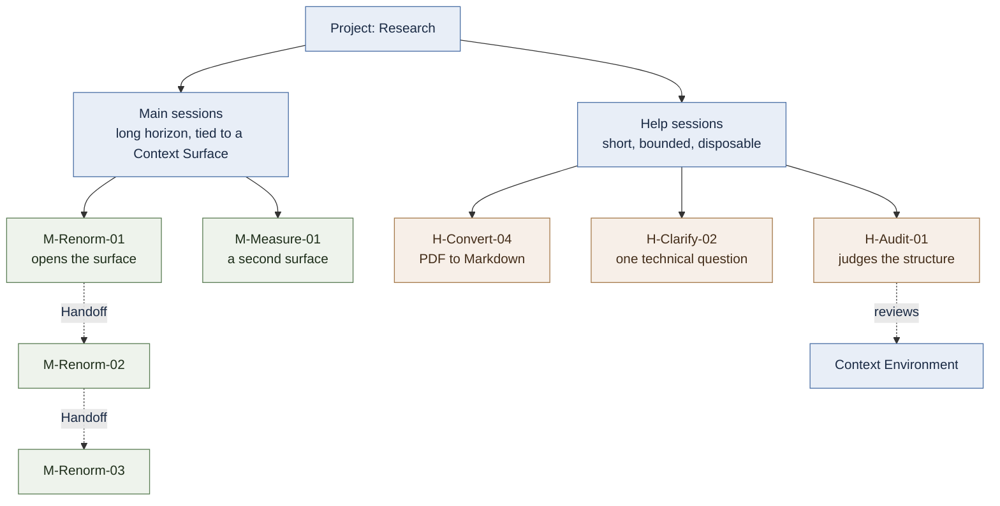

# AI Augmentation

  <em><a href="https://www.imsc.res.in/partha_mukhopadhyay">Partha Mukhopadhyay</a> </em>

## 1. Introduction

For the general public, Artificial Intelligence is primarily accessible through consumer applications offered by providers such as OpenAI, Anthropic, Llama, and Google. Users typically interface with these models via monthly premium subscriptions or pay-as-you-go API keys. This guide focuses primarily on subscription-based workflows.

Historically, interactions were confined to sandboxed, ephemeral chat sessions. Utilizing AI in this manner - characterized by an isolated, well-defined, one-time objective - is best classified as **AI Assistance**.

**AI Augmentation (AIA)**, conversely, represents a deeper integration of AI tools into complex human objectives. A **Project** is defined as an ongoing, thematic pursuit characterized by intricate nuances and an evolving workflow. AIA establishes a deeply contextual relationship where the AI is invited into a specific, long-term role within the project - acting as a specialized research assistant, a strategic advisor, or a technical co-developer.

AIA is a general method. It applies wherever a human pursues a complex, long-horizon objective that exceeds what a single person can hold in view at once - legal casework, product development, writing, investigative research. **Within the [Tāttvika](../README.md) context, its primary audience is the research scholar - institutional and independent alike** - and its examples are drawn from academic inquiry, but the architecture described here is not specific to academia. A reader from another domain should find the structure transfers with only the vocabulary changed.

### 1.1. The Core Thesis of AIA: Democratization and Liberation
At its philosophical core, AIA is driven by a liberating thesis: **AI can empower a discerning human to navigate, synthesize, and build upon public-domain knowledge that they can meaningfully direct and verify, substantially independent of their formal credentials in that domain.**

Note the two boundaries built into that sentence, because they are what make it defensible. The knowledge must be one the human can *direct and verify* - not any knowledge whatsoever. And what AIA dissolves is the **credential**, not the **competence**.

In traditional institutional academia, highly complex fields protect themselves through intensive, siloed specialization. This specialization plays two roles that must be told apart. Genuinely, it safeguards rigor - the accumulated standards, failure-awareness, and tacit judgment that keep a field honest. But it also erects **access gatekeepers** - controlling not the truth itself, but the pathways to it, often behind a credential.

AIA targets the second role, not the first. By pairing raw machine intelligence with wise human oversight, it offers the *in-principle possibility* of venturing into a domain outside one's formal training. What it emphatically does **not** do is supply rigor, or relieve the user of responsibility for it. It removes the credential-gate and, in the same motion, **relocates the full burden of rigor onto the user** - who must now decide, case by case, whether they can actually meet the standards of the field they have entered. That decision is nuanced and situation-specific, and it is theirs alone. AIA is therefore not automated production, nor a shortcut around expertise; it is the *relocation of responsibility* from the institution to the individual. Where the individual can carry that responsibility, the fortress becomes an open landscape. Where they cannot, no amount of machine intelligence will rescue the inquiry - and honest practice means recognizing which case one is in.

This single principle - **AIA moves responsibility; it does not dissolve it** - recurs throughout what follows, and is the spine of the method.

## 2. Basics of How AI Works

This section is purely educational: to deploy AIA well, a practitioner needs an accurate mental model of what a modern Large Language Model (LLM) is and is not. The most consequential correction it offers is this: **you do not teach an AI your subject. You assemble a context it reasons over.**

*   **Statelessness:** LLMs are structurally stateless between discrete prompts; every turn is entirely standalone. With each new prompt, the complete conversational history within that session is bundled and transmitted to the server for computation.
    *   *Note: While humans expend continuous cognitive energy to maintain active memory and context between thoughts, the AI is paid for on a per-turn compute basis. Modern platforms increasingly use server-side caching to preserve context temporarily during an active session, but the core architecture remains transactionally stateless.*
*   **You cannot "teach" the model - you can only contextualize it.** A common and costly misconception, especially among domain experts, is that one must first *teach the AI* one's field before it can help. Within the tools available to an end user, this is not possible: an ordinary user cannot alter the model's trained weights, and nothing learned in one session persists into the next. What feels like teaching is, in fact, *context assembly* - furnishing the model, each turn, with a rich and well-structured payload it reasons over afresh. A model given a thin prompt in an unfamiliar sub-field will underperform not because it "hasn't been taught," but because it has been under-contextualized. The entire discipline of AIA follows from this fact: the user's leverage is not pedagogy, it is context.
*   **Response Quality and Prompt Engineering:** The utility of an AI response is directly proportional to the architectural quality of the prompt. A **Prompt** is the aggregate of all data transmitted to the server in a single turn. The systematic structure, clarity, and informational richness of this payload dictate the value of the output.
    *   *Note on portability: Individual foundational models possess distinct training biases and traits, and this guide deliberately assumes model-independence - the method is written to transfer across providers. That assumption holds at the level of **method**. It does not fully hold at the level of **tooling**: file-editing quirks, integration regressions, and per-platform context limits are real and model-specific, and a practitioner will meet them. The methodology is portable; the tooling reality, as of this writing (2026), is not yet.*
*   **Context Window vs. Compute:**
    *   **Context Window:** The finite volume of data a session can hold at any given moment. As a session expands toward this limit, context compaction or truncation occurs, and critical information is silently lost - forcing the user to initialize a new session.
    *   **Compute:** The processing power the server expends to synthesize an answer or execute a task, throttled according to your subscription tier.
*   **Efficiency:** An optimized AIA workflow minimizes consumption of both Context Window and Compute. This is achieved by systematically constraining the physical length of the active chat history - keeping both prompts and responses concise within the chat interface, using a mechanism detailed below. As a context window saturates with low-value tokens, *response quality* falls; managing this is a core operational skill, not an afterthought.

## 3. Principles and Methods of AIA

Human achievement relies on a delicate interplay between raw intelligence and disciplined executive control. Just as a precision instrument requires a steady, deliberate hand to yield meaningful results, AIA is the practice of strategically directing AI to accomplish creative, non-linear goals that would otherwise be structurally impossible for a single individual.

This impossibility does not refer to mechanical or repetitive tasks; it refers to the demanding creative and cognitive milestones inherent to advanced research. For example, AIA should empower a researcher to venture confidently into highly specialized domains outside their native expertise, rather than merely accelerating output within their established comfort zone - the latter of which misinterprets the true purpose of fundamental research.

**A note on what "human control" means here.** The stated aim of AIA is to operate with full human awareness at every stage - but this must be understood precisely, because Section 3.6 (*Delegation*) will describe *delegating* execution to the AI, and the two can appear to contradict. They do not. What the human retains absolutely is **authority**: the judgment of what counts, the acceptance of a result as valid, and answerability for the consequence. What is delegated is **execution at every level the machine can reach** - not merely drafting, formatting and administrative maneuvering, but genuinely cognitive work: evaluating competing strategies, recognizing patterns across a literature no single reader holds at once, constructing the strongest counter-case, proposing lines of attack. The line is not drawn between creative and mechanical labor, and a method that pretended otherwise would be selling itself short. It is drawn between **contribution and authority**: the AI may originate anything, and settle nothing. The human is not aware of every token; the human is answerable for every consequence. This is the same principle as §1.1 in operational dress: responsibility is retained even as execution is delegated.

The core operational components of AIA are outlined below.

### 3.1. Coedit
Coediting is the process of collaborating with an AI agent directly on a local file system within an interface that simultaneously supports conversational discussion. Platforms like Claude and ChatGPT offer native environments for this integration (such as *Cowork* and *Work* spaces).

Alternatively, the same capability can be achieved within standard chat sessions using Model Context Protocol (MCP) tools - a method that, as of this writing (2026), is rapidly gaining adoption. In environments lacking native MCP integration, alternative platforms may utilize secure GitHub repository syncing to bridge local workspaces with the AI interface.

### 3.2. Project Description
The Project Description establishes the highest level of administrative scope. For example, a single overarching project labeled `Research` may encompass all active scientific inquiries pursued by a single scholar. Because a researcher's individual investigations are frequently interconnected, a single project architecture is often ideal. If completely decoupled, disparate lines of research should be segregated into independent AI projects.

### 3.3. System Instructions
Every individual Project requires a dedicated set of System Instructions that explicitly define the AI agent's persona, boundaries, and behavioral constraints. This configuration hardcodes the rules governing all subsequent sessions within that project. Crucially, it defines the paths to the local workspaces where Coediting occurs.

Consider an operational scenario utilizing two distinct local directories:
1.  `/VAULT/WorkSpace`: Located within an Obsidian vault, dedicated strictly to interconnected Markdown files.
2.  `/WRITE/WorkSpace`: A read/write local directory handling all other operational file types (code, data, binaries).

Both directories are managed via private GitHub repositories. Each contains an isolated subfolder named `/HumanSpace`, reserved exclusively for the human user to store personal references, system backups, or sensitive notes.

**The System Instructions must explicitly forbid the AI agent from accessing or scanning `/HumanSpace` except on explicit, one-time permission.** This is more than a configuration detail - it is a foundational trust mechanism. A method that invites an AI deep into one's ongoing intellectual life needs a clearly demarcated private space the agent will not enter unbidden, and a discipline of naming the boundary each time it is crossed rather than treating permission as standing. This single rule does much of the work of making the whole approach ethically and psychologically tenable for sustained use.

### 3.4. Context Environment
The Context Environment is a structured local directory - ideally populated with cleanly formatted Markdown files - that serves as the definitive source of truth from which the AI agent extracts situational context. In our architecture, this is the Obsidian vault workspace.

The directory tree should be cleanly hierarchical wherever the structure of the inquiry is actually settled - a qualification §4.4 takes up in earnest. Furthermore, it should include a living onboarding document that acts as an operational guide, instructing any newly initialized AI session on how to parse and navigate the directory tree. This documentation ensures the entire project environment remains completely portable.

**What the Context Environment fundamentally is - and this is the intellectual heart of the method - is a structural externalization of the researcher's own cognitive map.** Not a filing cabinet, where documents are stored for retrieval by category, but a *model of how the researcher is thinking about the problem*, rendered into a navigable structure. The folder hierarchy carries the decomposition of the inquiry; the cross-references (Wikilinks) carry the associations the researcher's own reasoning makes. Between them, the environment approximates the shape of a particular mind at work on a particular problem.

Two consequences follow.

The first is for the researcher. The environment records where the understanding currently stands and how far the work has come, so it is the quickest way back into your own thinking after a break. Returning is a matter of reading rather than reconstructing, and a researcher who returns quickly can direct the next task precisely.

The second is for the agent. The AI does not see the environment whole; it holds what is placed in front of it. What the structure gives you is that any part of it can be brought into view in one move: a path, a Wikilink, a pointer to the root documents. The AI works within your thinking rather than beside it, not because it sees the whole map, but because everything you show it is already part of a structure you built.

Together these give the characteristic unit of AIA: one directed application of the AI inside the environment, yielding a single non-trivial step of progress. The quality of that step is bounded by the fidelity of the map. A vault that mirrors how you understand the problem lets the AI reason as an extension of that understanding; a vault that is only a tidy archive reduces it to a lookup tool. Building the map is therefore not clerical overhead. It is thinking made durable, and shareable with a collaborator that has no map of its own but can operate faithfully inside yours.

That faithfulness cuts both ways, and §4.4 returns to it: a map is mirrored blind spots and all. An AI reasoning accurately inside a subtly wrong structure will not correct it - it will elaborate it, fluently, and in your own idiom.

### 3.5. Context Engineering
Context Engineering is the systematic cultivation of the Context Environment introduced above - the ongoing labor of building and refining the cognitive map so that it continues to mirror the researcher's evolving understanding. The user shapes the environment by reflecting on their own thought processes, isolating the precise vectors where AI intervention will yield the highest utility.

The recommended workflow operates as follows. The researcher begins at the macro level with the *Project Description*, then maps out a top-down hierarchy of milestones required to achieve the long-term goal. The root level of the environment directory contains living documents detailing the current state of the project, overarching objectives, active roadmaps, and cumulative progress logs.

Each subsequent sub-directory branch represents a **Context Surface** - a localized workspace optimized for a specific sub-goal. A Context Surface contains the **Active Memory**: the exact cluster of files the AI agent must manipulate to complete the immediate task. While operating on a specific surface, contextual data from alternate nodes in the project tree can be seamlessly imported using standardized Markdown cross-references (Wikilinks).

Constructing a rich Context Surface populated with highly relevant files is the absolute prerequisite for securing specialist-grade AI outputs.

*Important Caveats:*
1.  This methodology is entirely distinct from training or fine-tuning a model, which are backend engineering processes outside the end-user's control.
2.  The primary leverage available to the user lies in engineering a concise, hyper-focused context payload.
3.  Once the Context Environment is rigorously structured within the vault, the user simply points the AI to specific files, keeping the input text prompt minimal. Similarly, the agent should be instructed to write extensive outputs directly into structured Markdown files at paths specified by the user, while suppressing duplicate text generation within the chat window itself. This bi-directional efficiency drastically minimizes context-window saturation and forestalls the decline in response quality that accompanies a bloated session.

### 3.6. Delegation
Because the Context Environment acts as a structural, digital representation of the researcher's own cognitive map, it must evolve dynamically alongside the work. When first entering a new Context Surface, the internal sub-structures are rarely fully crystallized.

Accordingly, initial explorations can be conducted as a "High-Temperature" session - metaphorically mirroring an LLM's creativity parameters - allowing for fluid, unstructured brainstorming. As conceptual clarity is reached and the metaphorical temperature cools, the AI agent can be instructed to formalize the discussion into structured workflow documents and **Handoff files**, which are then used to seed new, hyper-focused sessions.

Through this method, the human retains authority over what counts and what is finally accepted, while the AI carries the execution - including the genuinely generative parts of it. Recall the distinction drawn at the head of Section 3: what is delegated is contribution, never the authority to decide what counts or the duty to verify it. This must always be executed with deliberate intent, ensuring that automation serves genuine breakthroughs rather than mindless production.

### 3.7. Session Management
Because the model is stateless, the **session** - not the day, not the file - is the natural unit of work, and a long project accumulates many of them. Treating sessions as typed and named objects rather than as an undifferentiated stream is what keeps that accumulation navigable.

Two types are worth distinguishing. A **Main session** carries a long contextual horizon: it operates on a Context Surface, builds understanding across many turns, and terminates in a Handoff. A **Help session** has no such horizon - it exists for a single bounded task that supports the main work without belonging to it: a file conversion, a technical clarification, a formatting utility. Declaring which kind of session is being opened, in the initiating prompt, is itself the technique; it tells the agent how much persistence and depth to assume, and prevents a throwaway query from accreting context it does not need.

One use of the Help session deserves particular emphasis. An agent can be pointed at the Context Environment *as a structure* - not to work inside it, but to judge it: is the scaffolding of the Context Surfaces consistent, is anything committed too early, where has the hierarchy stopped matching the inquiry? Because such a session has not reasoned inside the map, it has no investment in it, which makes it a partial remedy for the blind-spot inheritance described in §4.4 and a modest instance of the adversarial pressure §5 calls for.

Finally, a naming and numbering convention across both types turns the session history into a legible record of how the work actually proceeded, which is worth more than it costs over the horizon of a long project. A simple scheme is enough: a letter for the type, a tag for the surface or the task, and a number that runs within that tag. So `H-Convert-04` is the fourth conversion session, not the fourth Help session overall.

The Main sessions chain through Handoffs and stay tied to one surface. The Help sessions do not chain at all; each is opened, used, and abandoned. `H-Audit-01` is the exception worth keeping a record of, since its findings feed back into the environment itself.

### 3.8. Tooling
The efficacy of Context Engineering depends entirely on the user's ability to feed high-fidelity, cleanly structured data into the Active Memory of a given Context Surface. Transforming disparate external resources (web pages, PDFs, raw datasets) into clean, AI-ingestible Markdown is an ongoing engineering challenge.

To prevent this technical friction from disrupting core research, it is highly recommended to maintain a completely independent project named `Tools`. Configured with a dedicated developer persona, this agent's sole purpose is to build, refine, and maintain the conversion scripts, parsers, and automation utilities required across all your primary research projects.

## 4. Failure Modes & the Cost to the Human

The preceding sections describe the method when it works. An honest account must also state what it costs and how it fails - both because a practitioner deciding whether to adopt AIA deserves to know, and because the method's *safety* depends on the human understanding exactly where it is fragile.

### 4.1. The cost: load is relocated, not removed
AIA does not reduce cognitive burden; it **relocates** it. The labor of production - drafting, computing, searching, and much of the generative work of proposing and exploring - moves to the machine. In its place, the human takes on the labor of **direction and verification**: constructing context, checking every consequential output, catching errors, and holding the strategic thread across sessions the machine cannot remember. For sustained, high-stakes work this verification burden is substantial and unglamorous. A practitioner who expects AIA to *lighten* the work will be disappointed; what it does is convert the work into a form where a single discerning person can direct a scope that would otherwise require a team. The gain is reach, not ease.

### 4.2. The signature failure: confident confabulation
The characteristic failure of an LLM is not the obvious error but the **fluent, plausible, confidently-asserted falsehood** - a fabricated citation, a misremembered rule, a specific claim delivered with the same tone as a correct one. The model will not usually stop to check itself unless it is asked to, so it cannot be relied on to warn you. The entire safety of the method therefore rests on the human being *able and willing* to catch these. This is why §1.1 insists the domain be one the user can **verify**: AIA is safe precisely to the degree that the human can detect confident confabulation, and unsafe to the degree they cannot. A user operating in a domain where they cannot sense when an answer "smells wrong" is not augmented - they are exposed.

### 4.3. Statelessness as a hazard, not just a billing model
Section 2 described statelessness as an architectural fact. Here is its practical consequence: **the AI cannot be trusted to stay coherent across sessions, and will silently lose or contradict earlier conclusions** as context is truncated. Much of the machinery in Section 3 - the living documents, the Handoff files, versioned records, a durable log of decisions and their reasons - exists precisely as a prosthetic for this deficit. The human, or the structured environment they maintain, *is* the memory. Neglect that scaffolding and the method degrades turn by turn into confident incoherence.

Seen from the other side, this is a division of labour rather than a defect. The environment holds *duration*; the AI supplies *intensity* - a narrow, high-power discharge that carries a substantial task across a short span. The scaffolding exists so that there is something worth discharging into.

### 4.4. The map's blind spots are inherited
The three failures above are the machine's. This one belongs to the environment, and is subtler for it. Section 3.4 argued that the Context Environment's value lies in its fidelity to the researcher's cognitive map - but a faithful mirror reflects everything, including mis-framings, premature commitments, and the questions that were never asked. An AI reasoning accurately inside a subtly wrong structure does not correct it; it elaborates it, and the output feels right precisely because it is native to the map. Where §4.2 describes a collaborator that is a *favorable* critic, this describes an environment that is a *confirming* one. The two compound.

The mitigation is architectural, and follows from recognizing that a cognitive map is a hypothesis, not a record. **Build the environment gradually, and commit structure only as far as understanding is genuinely settled.** Where the researcher is sure of a decomposition, hierarchy is appropriate and earns its rigidity; where they are not, the region should be held deliberately loose - flat, provisional, cross-linked rather than nested - so that the structure remains cheap to revise when the understanding moves. This preserves the researcher's capacity to course-correct, which premature structure quietly removes. It is the same discipline §3.6 describes in another register: a Context Surface is formalized only once the metaphorical temperature has cooled.

Premature structure, then, is not merely untidy. It is a claim about the problem, silently asserted, and thereafter reasoned inside of by a collaborator with no independent standing from which to doubt it.

### 4.5. The mitigations, restated as discipline
None of these failure modes is disqualifying, but each demands a standing practice:
*   **Verify what counts, always.** Every output that will have a consequence is checked by the human before it is relied upon. Delegation of execution is never delegation of trust.
*   **Maintain the memory scaffolding.** Treat the living documents and handoffs not as bureaucracy but as the load-bearing structure that keeps a stateless collaborator coherent.
*   **Stay inside your verification envelope.** Venture into new domains freely - but know the boundary between "new to me but auditable" and "beyond my ability to check," and treat the latter with according caution.
*   **Hold unsettled structure loose.** Commit hierarchy only where the shape of the inquiry is genuinely known; keep the rest provisional and revisable, so the environment can course-correct with your understanding rather than fossilizing an early guess.
*   **Seek adversarial pressure.** The AI, operating inside your system and optimized to be helpful, is a *favorable* critic. Consequential work should also face pressure from something that has no incentive to agree. Section 5 sets out what that pressure can consist of.

Each of these is the spine of §1.1 in practical dress. The method's power and its danger are the same fact seen from two sides.

## 5. Creative Autonomy

A method is only as meaningful as the freedom it grants. **Creative autonomy** is the freedom to choose what you work on, how you work on it, and when an idea is worth pursuing. Where it is absent, work narrows to what has already been approved, and safe conventional thinking becomes the rational default. What autonomy requires, then, is the right to explore the unknown before anyone else can see the point of the journey. This is what AIA is built to protect.

Two things follow. You can venture into a domain you were never credentialed in, provided you can direct and verify the work there. And you can carry an unconventional line far enough to find out whether it holds, in private, before exposing it. Neither is a small thing. Most ideas that die do so early, while they are still too rough to defend and their author is the only person who can see the shape of them.

But this kind of autonomy carries its own risk, and the rest of the section is about paying for it.

### 5.1. Adversarial pressure

Working alone with a fluent collaborator is a comfortable way to be wrong. Section 4.2 described the AI as a favorable critic: it sits inside your system and is built to be helpful. Section 4.4 described the environment as a confirming one: it mirrors your map, blind spots included. Together they can sustain an error for a long time, and neither will raise its hand.

So adversarial pressure is not optional. Consequential work has to meet something that has no reason to agree with it. Several avenues are available, and they combine well:

*   **Turn the AI hostile on purpose.** The same collaborator that agrees by default can be told to attack: argue the opposing case, find the weakest claim, refuse to confirm. It is still inside your system, so it is a limited adversary. It is also free, immediate, and almost never used.
*   **Go to the primary source.** Check every consequential claim against the original paper, dataset, statute or proof. This is the verification §1.1 already demands, made routine. It requires nobody's permission.
*   **Find an adversarial community rather than an adversarial institution.** Open peer networks, preprint commentary, public critique, correspondence with others working the same question. These give genuine hostile reading without a credential check at the door.

None of these fully replaces rigorous review by someone who knows the field and has reason to be skeptical, and it is worth saying so plainly. But they are real, they are reachable, and used with discipline they are enough to keep serious work honest.

### 5.2. The wager

AIA does not promise that anyone can do anything. It promises something narrower: that a discerning, self-critical mind can venture into hard territory, direct a machine intelligence through it, verify the results against reality, and produce work of substance, provided it accepts the responsibility that comes with it. The gate it removes is the one guarding the door. The rigor it demands, it demands of everyone alike. **AIA moves responsibility to the human; it does not dissolve it**, and in that relocation lies both its liberation and its discipline.

***

  <em>Created: August 18, 2026 </em>
   
  <em>Language refinement and Markdown formatting assisted by Claude.</em>

